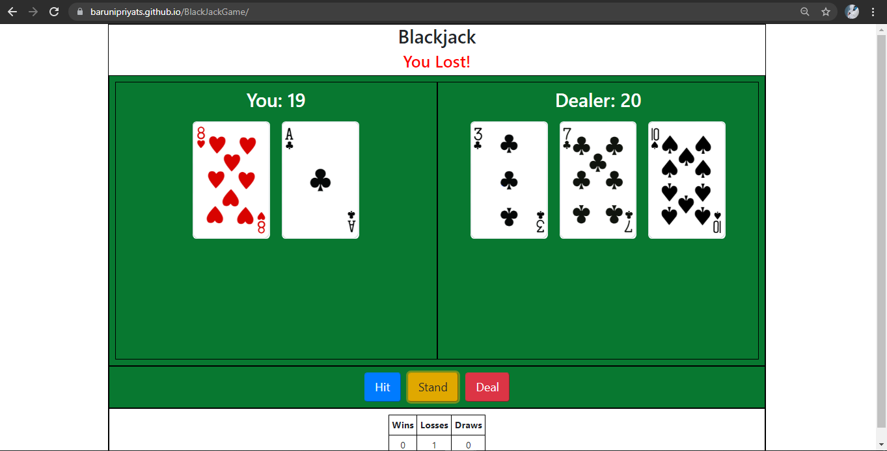

# BlackJackGame
***
Blackjack game is a classic casino game of luck and strategy. It is the most popular and most playing casino game in the entire world and is also known as twenty one.  
The goal of blackjack is simple - to get as close as possible to 21 without going over, and to have a higher hand than the dealer. 
If the dealer goes over 21, they bust and lose the game. The same goes for you.
Here the dealer is the computer itself. 

# General Info
***
Step 1 - Decide whether to Hit or Stand
Work out the value of your hand, as well as that of the dealer, to get as close as possible to 21 without going bust by pressing the 'Hit' button.

Step 2 - Your Hand Value
As a result of the move you just made, you’ll probably have a new hand value. 
You'll remain in the game if your hand is valued at 21 or anything less. Once done, press the 'Stand' button. Now the chance goes to the dealer. 

Step 3 - Dealer Reveals Their Cards
Once you hit the 'Stand' button, the dealer reveals their cards. 

Step 4 - See Who is Closer to 21
If your hand is closer to 21 than that of the dealer, you bust the dealer and win. If the dealer has 21 or a closer score to 21 than any of the other players, the dealer wins.

#Screenshot
***

